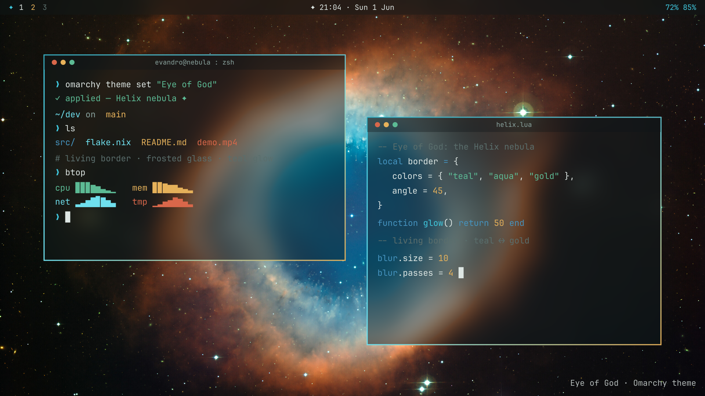
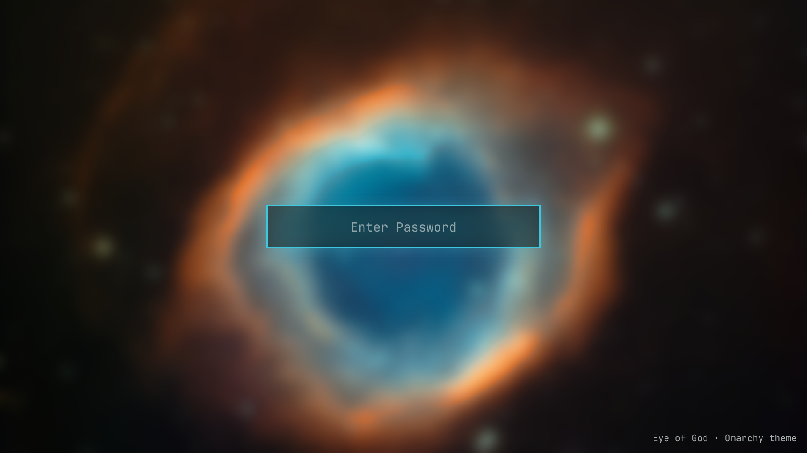
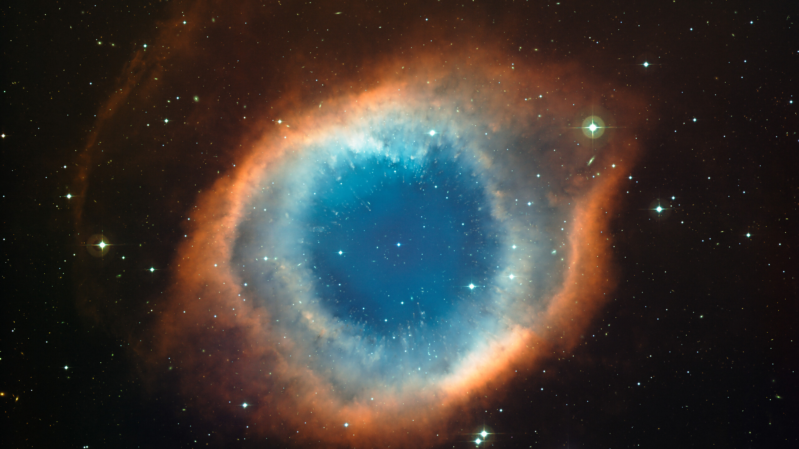

# Eye of God — an Omarchy theme

A theme built around a real photo of the **Helix Nebula** (NGC 7293), the
"Eye of God": deep teal and cyan of the iris with the gold and amber of its
gas, over a dark deep-space background. It pulls out the full Hyprland toolkit
— a window border that's genuinely **alive**, heavy frosted glass everywhere,
and a teal **glow**.







## Palette

| Role        | Hex       |
|-------------|-----------|
| Background  | `#0d1417` |
| Foreground  | `#dde6e3` |
| Accent (teal) | `#3fc7dd` |
| Red (rust)  | `#d9674a` |
| Green (sea) | `#5cba94` |
| Gold        | `#e6b15a` |
| Blue (iris) | `#4593bf` |
| Orchid      | `#ab7fb0` |
| Cyan        | `#6fe0ee` |

## Hyprland showcase

- **★ Living border** — a Lua `hl.timer` flows the active border's gradient
  through the Helix spectrum (teal → aqua → gold → rust), rotates it and pulses
  the glow **continuously** (~2% CPU) — independent of VFR and workspace
  switches, works on the Lua / dev channel. The theme's signature.
- **macOS-style frosted glass** — brightened blur on translucent windows,
  terminals, Waybar, Walker, notifications and SwayOSD (`layerrule = blur`)
- **Teal glow shadows** that pulse in sync with the border
- **Thin borders + square corners**, dimmed inactive windows, springy motion
- Wallpaper: a real **Helix Nebula** photo by ESO + the conventional
  `omarchy.png` recoloured in the nebula's teal→gold (see [CREDITS](CREDITS.md))

## Use

```bash
omarchy theme set "Eye of God"
omarchy theme bg next   # cycle wallpapers
```

> The living border is light but always animating. To make the theme static,
> delete the `LIVING BORDER` timer block at the end of `hyprland.lua`.

## Install

```bash
omarchy theme install https://github.com/Esegnorelli/omarchy-eye-of-god-theme.git
```

## License

Theme config & `omarchy.png`: MIT (see [LICENSE](LICENSE)).
Wallpaper: © ESO, CC BY 4.0 (see [CREDITS](CREDITS.md)).
